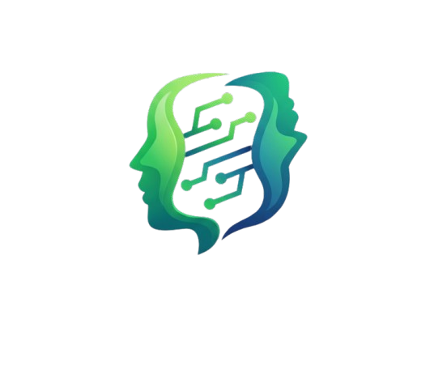
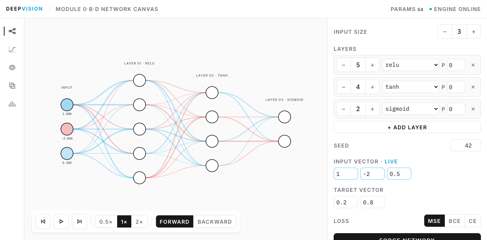
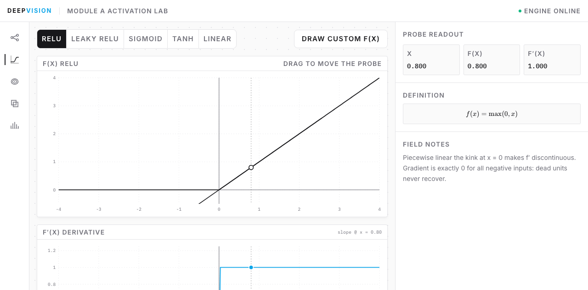
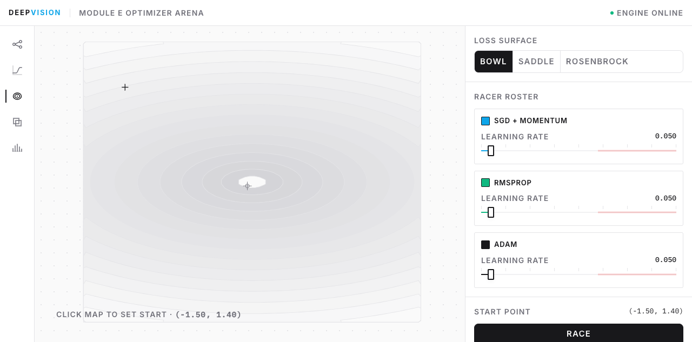
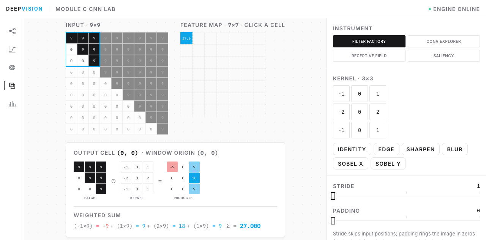
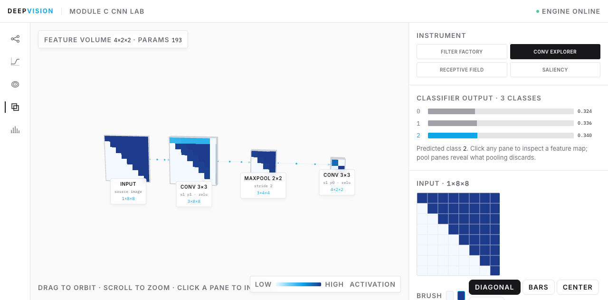
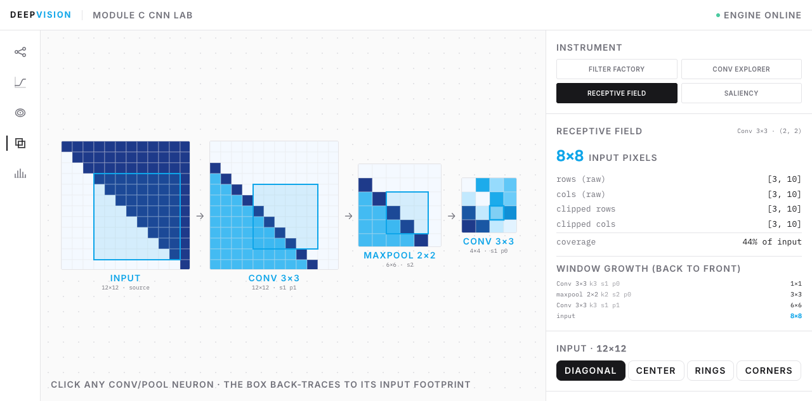
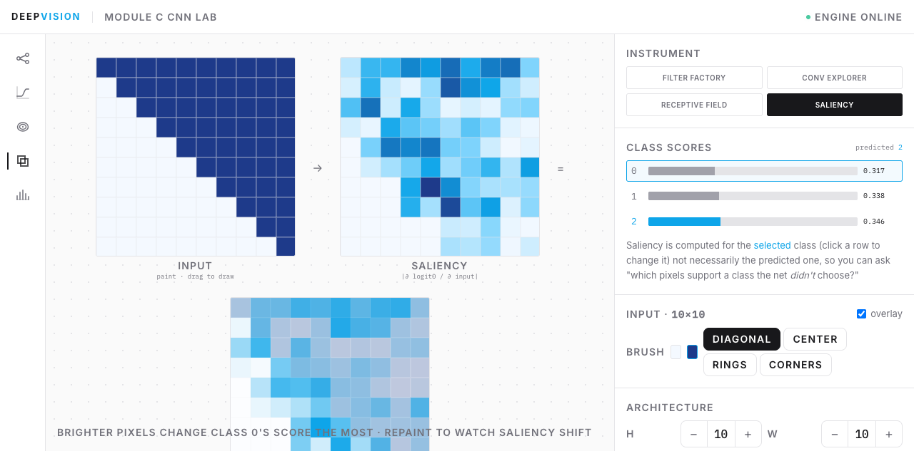
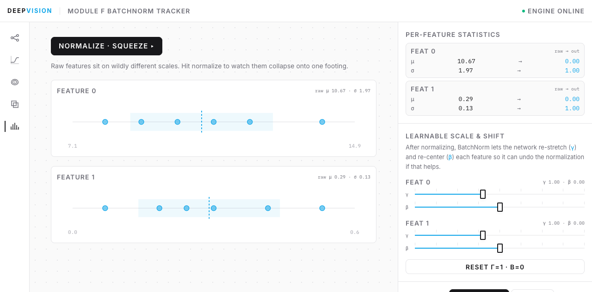
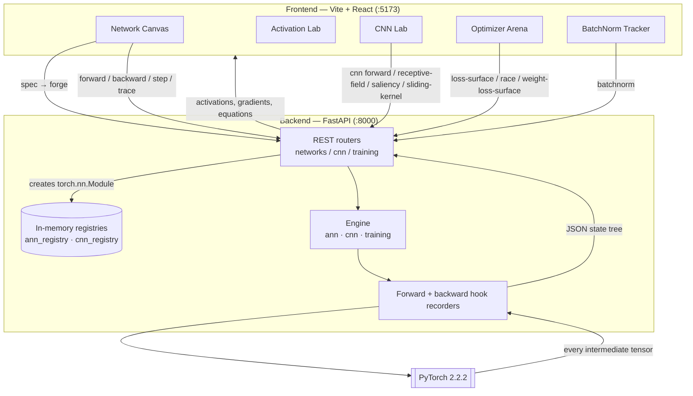

<div align="center">



# DeepVision

**An interactive instrument for seeing how neural networks actually work — every weight, activation, gradient and feature map read live from a real PyTorch engine.**

A teaching instrument, not a training framework.

</div>

---

> [!IMPORTANT]
> **Nothing in DeepVision is faked.** The frontend never re-implements the math in JavaScript. Every number on screen — activations, gradients, loss, feature maps, receptive fields, saliency — is computed by PyTorch on the backend and rendered as-is. If the engine is offline, the canvas says so rather than showing plausible-looking numbers.

## What it does

```
Define an architecture (layers, activations, dropout, kernels)
        │
        ▼
 forge a real torch.nn.Module (seeded, reproducible)
        │
        ▼
 run a forward pass every intermediate tensor captured via hooks
        │
        ▼
 step through it layer by layer (VCR-style playback)
        │
        ▼
 backpropagate gradients captured, chain rule traceable per weight
        │
        ▼
 apply gradient steps and watch the loss fall / weights change
        │
        ▼
 inspect any neuron, edge, filter, feature map or input pixel
```

## Screenshots

| Network Canvas semantic-zoom graph, live activations, forward/backward stepping, gradient descent |
|---|
|  |

| Activation Lab curves, derivatives, freehand draw | Optimizer Arena loss surfaces & optimizer racing |
|---|---|
|  |  |

| Filter Factory hand-edit a kernel, watch it convolve | Conv Explorer feature maps as stacked glass panes in 3D |
|---|---|
|  |  |

| Receptive Field back-trace a deep neuron to its input patch | Saliency which pixels move a class score |
|---|---|
|  |  |

| BatchNorm Tracker watch features squeeze to μ=0, σ=1 |
|---|
|  |

---

## The instruments

| Module | Route | What you can do |
|---|---|---|
| **0 · B · D**  Network Canvas | `/` | Zoomable D3 graph with semantic zoom. Step a forward pass layer by layer, flip to backward mode to watch gradients flow, click any edge for a full chain-rule trace, click any neuron for its exact arithmetic. Edit the input and re-run through frozen weights ("what-if"). Apply SGD steps and watch weights update and loss fall. Dial dropout up and watch units rain out. |
| **A** Activation Lab | `/activations` | Activation curves and their derivatives, a draggable probe, and a freehand draw mode. |
| **C** CNN Lab | `/cnn` | Four instruments: **Filter Factory** (edit a kernel by hand, step the sliding window, click any output cell for the term-by-term weighted sum), **Conv Explorer** (feature maps as stacked glass panes in 3D; click a pixel for the full multi-channel convolution), **Receptive Field** (click a deep neuron, watch the box back-trace to its input footprint), **Saliency** (paint an input, see which pixels drive a class). |
| **E** Optimizer Arena | `/optimizers` | Loss surfaces, optimizer racing, divergence, momentum vectors. |
| **F** Dropout & BatchNorm | `/` + `/batchnorm` | Dropout Rain lives in the Network Canvas (train/eval toggle, live drop mask). BatchNorm Tracker animates a batch collapsing onto μ=0, σ=1, with γ/β sliders to re-stretch it. |

---

## Architecture



**The state-tree boundary:** a forward or backward call doesn't just return an output  it returns a *state tree*: every layer's input, weights, biases, pre activation, post-activation, dropout mask, per-weight gradients, and LaTeX-rendered equations. The frontend is a pure renderer of that tree. This is why stepping, what-if editing, and the chain-rule tracer are all exact rather than approximations.

### Why hooks, and why the order matters

Intermediate tensors are captured with `register_forward_hook` / `register_full_backward_hook`. Backward hooks **must** be registered *before* `forward()` runs they attach to the autograd graph as it is built and cannot be retrofitted onto a completed pass. Both recorders therefore wrap forward + loss + backward in a single context (`build_backward_state_tree`).

### Why the receptive field is computed twice

`POST /cnn/receptive-field` walks the kernel/stride/padding recurrence backward through every stage pure geometry, exact regardless of weight values. The client mirrors that same recurrence to draw the per-stage boxes, but the **backend stays authoritative** for the reported numbers. Both use identical math, so they cannot disagree.

---

## Tech stack

| Layer | Choice | Why |
|---|---|---|
| Engine | **PyTorch 2.2.2** | Real autograd the whole point. Hooks give exact intermediate tensors for free. |
| API | **FastAPI** + Pydantic v2 | Typed request/response, minimal boilerplate, automatic OpenAPI docs at `/docs`. |
| State | **In-memory registries** | No database. A "network" is a live `nn.Module` held by id; training steps mutate it in place, which is what makes "watch it learn" work. |
| Frontend | **React 19 + Vite 8** | Fast HMR; React 19 across the whole instrument surface. |
| Styling | **Tailwind v4** | CSS-first `@theme` keeps the "Pristine Light / Precision Engineering" design system in one file. |
| 2D graph & charts | **D3 v7** | Semantic-zoom network graph, loss contours, activation curves. |
| 3D | **Three.js + @react-three/fiber + drei** | Feature maps as stacked glass panes; `DataTexture` + `NearestFilter` keeps heat-maps crisp rather than blurred. |
| Motion | **Framer Motion** | Layer reveals, gradient pulses, dropout rain, the BatchNorm squeeze. |
| Math typesetting | **KaTeX** | Renders the exact per-neuron equations the engine emits. |
| Fonts | **Inter** + **IBM Plex Mono** | Mono tabular numerals so readouts don't jitter as digits roll. |
| Lint | **oxlint** | Fast, zero-config for this codebase. |
| Tests | **pytest** (255 tests) | The engine is the thing that must never be wrong, so it carries the test weight. |

### Design system

Off-white canvas `#FAFAFA` · panel `#FFFFFF` · line `#E4E4E7` · ink `#18181B` / `#71717A`, with three precision accents used strictly by meaning:

| Colour | Hex | Means |
|---|---|---|
| Cerulean | `#0EA5E9` | signal / selection / positive activation |
| Emerald | `#10B981` | engine online, healthy |
| Crimson | `#EF4444` | negative values, dead units, divergence, faults |

---

## Project structure

```
DeepVision/
├── backend/
│   ├── main.py                       # FastAPI app, CORS, router mounting, /health
│   ├── app/
│   │   ├── core/                     # in-memory registries
│   │   │   ├── base_registry.py
│   │   │   ├── ann_registry.py
│   │   │   └── cnn_registry.py
│   │   ├── engine/
│   │   │   ├── ann/                  # model, hooks, state_tree, chain_rule, loss, train_step
│   │   │   ├── cnn/                  # model, hooks, state_tree, receptive_field,
│   │   │   │                         #   saliency, sliding_kernel
│   │   │   ├── training/             # optimizers, optimizer_race, loss_surfaces,
│   │   │   │                         #   weight_loss_surface, batchnorm
│   │   │   └── common/serialize.py   # tensor → JSON-safe
│   │   ├── routers/                  # network.py · cnn.py · training.py
│   │   └── schemas/                  # Pydantic request/response models
│   ├── tests/                        # 255 tests
│   └── requirements.txt
├── client/
│   ├── src/
│   │   ├── pages/                    # NetworkCanvas, ActivationLab, OptimizerArena,
│   │   │                             #   CnnLab, BatchNormLab
│   │   ├── components/
│   │   │   ├── canvas/               # NetworkGraph, NodeCard, SpecEditor, TraceView, VCRControls
│   │   │   ├── cnn/                  # FilterFactory, ConvExplorer, FeatureScene,
│   │   │   │                         #   ReceptiveField, SaliencyLab
│   │   │   ├── layout/               # TopBar, NavRail, Workbench
│   │   │   └── ui/                   # InstrumentButton, SegmentedControl, Stepper, Fader,
│   │   │                             #   Odometer, KatexBlock, Toast, ErrorBoundary, ...
│   │   ├── lib/                      # api.js, useNetwork.js, useEngine.jsx, graphLayout.js
│   │   └── index.css                 # Tailwind v4 @theme — the whole design system
│   └── package.json
└── docs/screenshots/
```

---

## Getting started

### Prerequisites
- **Python 3.12** — `torch==2.2.2` has no wheels for newer versions
- **Node.js 18+**

### Backend

```sh
cd backend
python3.12 -m venv venv && source venv/bin/activate
pip install -r requirements.txt
uvicorn main:app --port 8000          # add --reload for dev
```

Verify: `curl http://127.0.0.1:8000/health` → `{"status":"ok"}` · interactive docs at `http://127.0.0.1:8000/docs`

### Frontend

```sh
cd client
npm install
npm run dev                           # http://localhost:5173
```

The top-bar LED reads **ENGINE ONLINE** (emerald) once it can reach the backend; the app auto-forges a default network and polls for the engine on its own.

### Tests

```sh
cd backend && source venv/bin/activate
pytest -q                             # 255 passed
```

---

## API reference

No auth, no database a network is a live `nn.Module` held in memory under a returned `network_id`.

| Method | Path | Purpose |
|---|---|---|
| `GET` | `/health` | Liveness check (drives the ENGINE ONLINE LED) |
| `POST` | `/networks` | Build a seeded ANN from a spec → `network_id`, `param_count` |
| `DELETE` | `/networks/{network_id}` | Release a network |
| `POST` | `/networks/forward` | Forward pass → full state tree (inputs, weights, pre/post activations, dropout mask, equations) |
| `POST` | `/networks/backward` | Forward + loss + backward → state tree **plus** every gradient |
| `POST` | `/networks/step` | Apply N SGD steps in place → `loss_history` + state tree at the new weights |
| `POST` | `/networks/trace` | Chain-rule trace for one weight; verifies against autograd (`matches_analytic`) |
| `POST` | `/cnn` | Build a seeded CNN from a spec → `network_id`, `output_shape`, `param_count` |
| `DELETE` | `/cnn/{network_id}` | Release a CNN |
| `POST` | `/cnn/forward` | CNN forward → per-stage inputs, kernels, feature maps, pooling `kept_mask` |
| `POST` | `/cnn/receptive-field` | Back-trace one output pixel → raw + clipped input ranges, RF size |
| `POST` | `/cnn/saliency` | `∂ logit / ∂ input` → saliency map, logits, probabilities, predicted class |
| `POST` | `/cnn/sliding-kernel` | Step-by-step convolution trace for an arbitrary kernel |
| `POST` | `/training/loss-surface` | Loss surface grid for the Optimizer Arena |
| `POST` | `/training/weight-loss-surface` | Loss surface sliced through two real weights |
| `POST` | `/training/race` | Race optimizers across a surface → per-step trajectories |
| `POST` | `/training/batchnorm` | Batch statistics → mean, variance, normalized, γ/β output, output μ/σ |

---

## Roadmap

### Up next
- **3D loss surface** for the Optimizer Arena — the plan called for dropping spheres onto a 3D terrain; what exists today is a 2D top-down `d3-contour` view. Three.js is already proven in-app (Conv Explorer), so this is a build-or-skip choice rather than an architecture question.
- **Deploy the backend** — currently localhost only. `CORS allow_origins=["*"]` must be tightened at the same time.

### Later
- Persist networks (survive a backend restart)
- Momentum/Adam steps in the Network Canvas (currently plain SGD)
- Image upload + larger grids for the Filter Factory
- Multi-filter banks and a ReLU overlay in the Filter Factory

### Explicitly avoided (and why)
- **Re-implementing the math in JavaScript.** It would make the frontend instant and offline-capable — and would also make every number a claim rather than a measurement. The engine boundary is the honesty guarantee.
- **A database.** Nothing here is worth persisting across sessions yet, and an in-memory registry is what lets `POST /networks/step` mutate real weights in place with no sync layer.
- **Marking dead ReLUs as "dropped".** A unit whose activation is already `0.0` is indistinguishable *by value* from one dropout just zeroed, so `dropped_mask` reports it as not-dropped rather than guessing. This is why a ReLU layer on an unlucky input can show few visible drops — tanh/sigmoid layers show the rain most reliably.

---

## Known limitations

- **In-memory only.** Restarting the backend drops every network; the frontend notices and re-forges. Intentional, but it means `--reload` during development resets state on every save.
- **Open CORS, no auth, no rate limiting.** `allow_origins=["*"]` and unauthenticated endpoints are fine for a local instrument, and a real gap before any public deploy.
- **Pinned dependencies.** `numpy<2` is required — `torch==2.2.2` is not compatible with NumPy 2.x. Python 3.12 for the same reason (no 2.2.2 wheels beyond it).
- **`backend/.gitignore` contains `tests`.** The 20 existing test files are tracked (they predate the rule), but a *new* test file would be silently skipped by `git add`. Worth removing that line.
- **The Optimizer Arena loss surface is 2D**, not the 3D terrain in the original plan — see Roadmap.
- **WebGL context limits.** Conv Explorer holds a live WebGL context; browsers cap roughly 16 of them, so dozens of rapid reloads in one session can blank the 3D view until the tab is reopened. Not triggered by normal use.
- **Dropout is train-mode only, by definition.** The train/eval toggle exists precisely to make that visible; in eval mode the drop mask is always empty.

---

## License

[MIT](LICENSE)

## A note on scope

DeepVision is an educational instrument for understanding mechanics: what a convolution *actually* computes, what one backprop step *actually* produces, what dropout and BatchNorm *actually* do to a tensor. It is not a training framework, and the networks it builds are small and randomly initialised by design — the point is the arithmetic being visible, not the accuracy being high.
